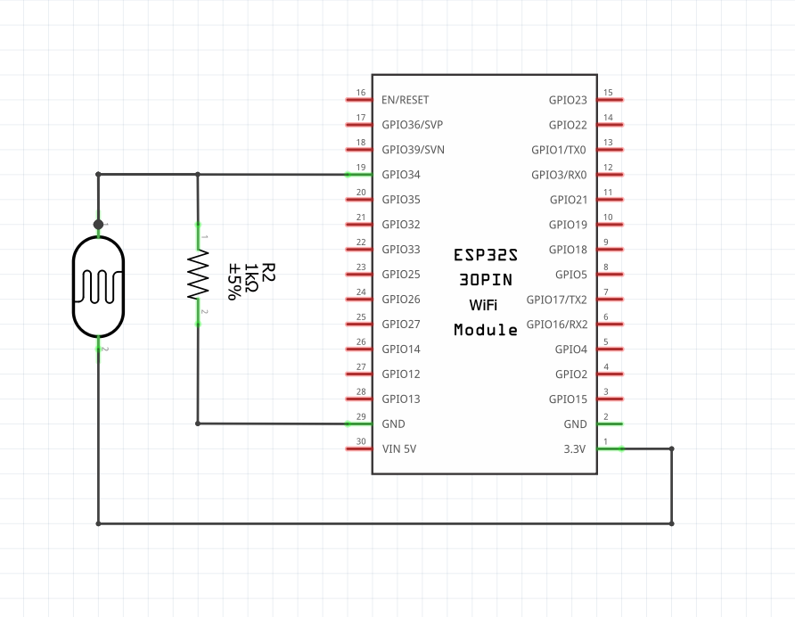
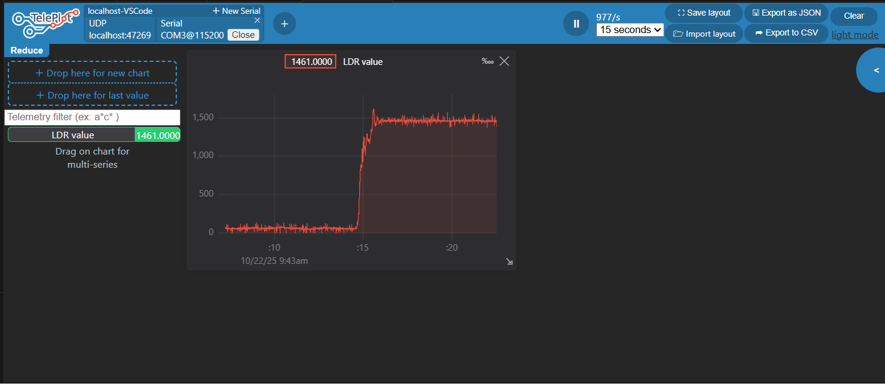

## Sử dụng ESP32 để đo cảm biến ánh sáng LDR

Các chức năng đã làm trong dự án này:
- Đọc giá trị độ sáng (tương đối) từ quang trở qua chân ADC(A0) của ESP32
- In giá trị này ra cổng UART dạng số nguyên (0 - 4095)
- Sử dụng công cụ vẽ đồ thị để vẽ đồ thị đo cường độ sáng thu được theo thời gian thực

## Material
- 1 x ESP32
- 1 x LDR
- 1 x resistor 470 ohm
- 1 x breadboard
- PlatformIO/VS code
- Teleplot/VS code
- Fritzing
- Wokwi Simulator (online)

## Connection

|  ESP32 Pin  |   Components   |  
|-------------|----------------|
| 3.3V        | Breadboard (+) |
| GND         | Breadboard (-) |
| GPIO34      | LDR PIN        |

## Wokwi Simulation
Dự án này bao gồm mô phỏng Wokwi để kiểm tra mạch mà không cần phần cứng thực tế:
- File `diagram.json`: Sơ đồ mạch mô phỏng với ESP32, LDR sensor và điện trở 470Ω
- File `wokwi.toml`: Cấu hình mô phỏng với firmware từ PlatformIO

Để chạy mô phỏng:
1. Build project với PlatformIO: `pio run`
2. Mở file `diagram.json` tại https://wokwi.com hoặc sử dụng Wokwi extension trong VS Code
3. Nhấn nút Play để bắt đầu mô phỏng
4. Điều chỉnh mức độ sáng trên LDR sensor bằng cách kéo thanh trượt
5. Xem giá trị đọc được trong Serial Monitor

## Result

Sử dụng công cụ vẽ đồ thị Teleplot để vẽ đồ thị đo cường độ sáng từ cảm biến LDR theo thời gian thực 