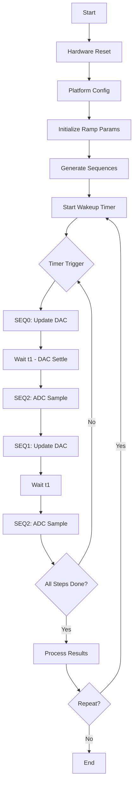

# Phân Tích Code AD5940_Ramp - Tổng Hợp

## Giới Thiệu

Repository này chứa phân tích chi tiết về code mẫu **AD5940_Ramp** từ [analogdevicesinc/ad5940-examples](https://github.com/analogdevicesinc/ad5940-examples/tree/master/examples/AD5940_Ramp).

AD5940_Ramp là một ví dụ điển hình về cách sử dụng chip AD5940 (Analog Front End của Analog Devices) để thực hiện các phép đo điện hóa với kỹ thuật ramping (quét điện áp tuyến tính).

## Tài Liệu

### 📄 [AD5940_Ramp_Analysis.md](./AD5940_Ramp_Analysis.md)
**Tài liệu phân tích tổng quan** (16KB, Vietnamese)

Nội dung:
- ✅ Tổng quan về AD5940_Ramp
- ✅ Phân tích chi tiết từng file source code
  - AD5940Main.c - Cấu hình và khởi động
  - RampTest.h - Định nghĩa cấu trúc và API
  - RampTest.c - Logic xử lý chính
- ✅ Kiến trúc tín hiệu Ramp
- ✅ Phương pháp Sequencer và Ping-Pong Buffer
- ✅ Luồng hoạt động (Flow) của chương trình
- ✅ Kỹ thuật quan trọng
- ✅ Ứng dụng trong điện hóa
- ✅ Ví dụ cấu hình tham số

### 📄 [AD5940_Technical_Details.md](./AD5940_Technical_Details.md)
**Chi tiết kỹ thuật chuyên sâu** (17KB, Vietnamese)

Nội dung:
- ✅ Cấu trúc bộ nhớ AD5940 (SRAM, FIFO, Sequencer)
- ✅ Chi tiết tín hiệu DAC (LPDAC specifications, code calculation)
- ✅ Chi tiết ADC Path (LPTIA, PGA, SINC3 Filter)
- ✅ Wakeup Timer Deep Dive (calibration, calculation)
- ✅ Sequence Generation Details (Init, ADC, DAC sequences)
- ✅ Interrupt Handling
- ✅ Điện hóa cơ bản (3-electrode system)
- ✅ Performance Analysis (timing, resolution, memory)
- ✅ Code Optimization Tips
- ✅ Debugging Tips
- ✅ Common Issues and Solutions

## Điểm Nổi Bật

### 🎯 Kỹ Thuật Chính

1. **Hardware Sequencer**
   - Tự động hóa điều khiển DAC và ADC
   - Giảm tải cho MCU
   - Timing chính xác và ổn định

2. **Ping-Pong Buffer**
   - Giải quyết vấn đề SRAM hạn chế (4kB)
   - Cho phép ramping với hàng trăm/ngàn bước
   - Update động trong runtime

3. **Low Power Design**
   - Sleep mode giữa các measurement
   - Wakeup Timer điều khiển chính xác
   - Tiết kiệm năng lượng ~76%

4. **Interrupt-Driven Architecture**
   - Non-blocking operation
   - Efficient FIFO management
   - Real-time data processing

### 📊 Thông Số Kỹ Thuật

```
Chip: AD5940/AD5941
- DAC: 12-bit (0.2V - 2.2V)
- ADC: 16-bit Delta-Sigma
- SRAM: 6kB (flexible allocation)
- Sequencer: Hardware-based
- Clock: 16MHz HFOSC, 32kHz LFOSC
```

### 🔬 Ứng Dụng

- Cyclic Voltammetry (CV)
- Linear Sweep Voltammetry (LSV)
- Electrochemical Sensor Testing
- Gas detection
- pH measurement
- Glucose sensing
- Water quality analysis

## Cấu Trúc Code

```
AD5940_Ramp/
├── AD5940Main.c (171 lines)
│   ├── RampShowResult()         - Display results
│   ├── AD5940PlatformCfg()      - Platform configuration
│   ├── AD5940RampStructInit()   - Parameter initialization
│   └── AD5940_Main()            - Main loop
│
├── RampTest.h (88 lines)
│   ├── AppRAMPCfg_Type          - Configuration structure
│   └── API declarations
│
└── RampTest.c (930 lines)
    ├── AppRAMPInit()            - Initialize application
    ├── AppRAMPCtrl()            - Control (start/stop)
    ├── AppRAMPISR()             - Interrupt handler
    └── Sequence generators      - DAC/ADC sequences
```

## Workflow



## Ví Dụ Cấu Hình

### Ramp Chậm (High Resolution)
```c
pRampCfg->RampStartVolt = -1000.0f;   // -1V
pRampCfg->RampPeakVolt = +1000.0f;    // +1V
pRampCfg->StepNumber = 800;           // 800 bước
pRampCfg->RampDuration = 24000;       // 24 giây
pRampCfg->SampleDelay = 7.0f;         // 7ms

// Mỗi bước: 30ms, Độ phân giải: 2.5mV/step
```

### Ramp Nhanh (Quick Scan)
```c
pRampCfg->RampStartVolt = -500.0f;    // -0.5V
pRampCfg->RampPeakVolt = +500.0f;     // +0.5V
pRampCfg->StepNumber = 200;           // 200 bước
pRampCfg->RampDuration = 2000;        // 2 giây
pRampCfg->SampleDelay = 2.0f;         // 2ms

// Mỗi bước: 10ms, Độ phân giải: 5mV/step
```

## Công Thức Quan Trọng

### DAC Code
```c
// Voltage to DAC Code
Code = (Voltage_mV - 200.0) * 4095.0 / 2000.0

// DAC Code to Voltage
Voltage_mV = Code * 2000.0 / 4095.0 + 200.0
```

### Current Calculation
```c
// Cell voltage
Vcell = Vbias - Vzero

// Sensor current
I_sensor = Vcell / Rsensor

// TIA output
V_TIA = I_sensor × R_TIA
```

### Timing
```c
// Time per step
TimePerStep = RampDuration / StepNumber

// Wakeup cycles
WakeupCycles = LFOSCFreq × Delay_ms / 1000.0 - 6
```

## Tài Liệu Tham Khảo

### Official Documentation
- [AD5940 Datasheet](https://www.analog.com/media/en/technical-documentation/data-sheets/AD5940.pdf)
- [AD5940 Wiki](https://wiki.analog.com/resources/eval/user-guides/ad5940)
- [AD5940 GitHub](https://github.com/analogdevicesinc/ad5940-examples)

### Evaluation Boards
- [EVAL-AD5940BIOZ](https://www.analog.com/en/design-center/evaluation-hardware-and-software/evaluation-boards-kits/EVAL-AD5940BIOZ.html) - Healthcare applications
- [EVAL-AD5940ELEC](https://www.analog.com/en/design-center/evaluation-hardware-and-software/evaluation-boards-kits/EVAL-AD5940ELCZ.html) - Industrial applications

### Tools
- [SensorPal](https://wiki.analog.com/resources/eval/user-guides/eval-ad5940/tools/sensorpal_setup_guide) - GUI tool

## Kết Luận

Phân tích này cung cấp cái nhìn toàn diện về code AD5940_Ramp, từ tổng quan đến chi tiết kỹ thuật. Các kỹ thuật được sử dụng trong code này có thể áp dụng cho:

✅ Các phép đo electrochemical khác  
✅ Impedance spectroscopy  
✅ Amperometric sensing  
✅ Potentiometric measurements  
✅ Custom sensor applications  

Code được viết tốt, có cấu trúc rõ ràng và dễ mở rộng cho các ứng dụng khác.

---

**Tác giả phân tích:** GitHub Copilot  
**Ngày tạo:** 2026-02-04  
**Nguồn gốc:** [AD5940 Examples - AD5940_Ramp](https://github.com/analogdevicesinc/ad5940-examples/tree/master/examples/AD5940_Ramp)  
**License:** Analog Devices Software License Agreement
